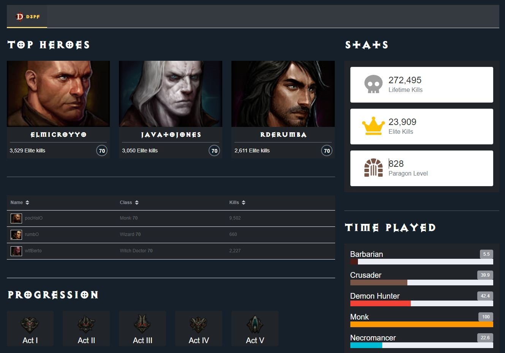

# Diablo 3 Profile Finder

[D3PF](https://diablo3dp-vue3.netlify.app/): Vue.js app created from scratch through [Vue CLI](https://cli.vuejs.org/) that consume official Diablo III APIs, a Blizzard's game.

## App Live Demo

[](https://app.netlify.com/sites/diablo3dp-vue3/deploys)

👉 https://diablo3dp-vue3.netlify.app/

> - User: `Prdik#2397`
> - Region: `EU`

---



---
## Project setup
```markdown
# Install
npm install

# Compiles and hot-reloads for development
npm run serve

# Compiles and minifies for production
npm run build

# Run your unit tests
npm run test:unit

# Run your end-to-end tests
npm run test:e2e

# Lints and fixes files
npm run lint
```

---
